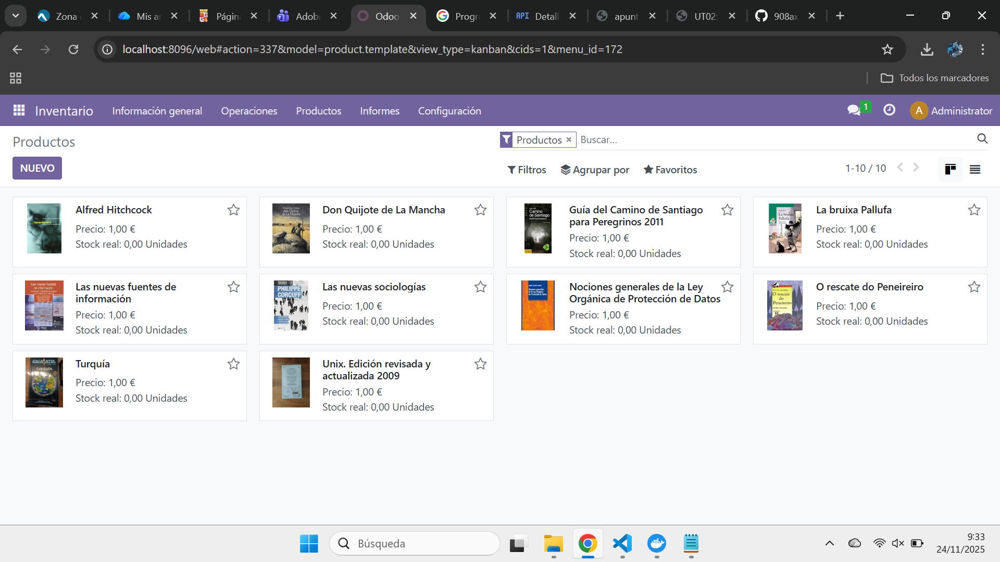

# [UT03](./index.md)

## Ejercicio paso a paso
```
PR0301: Facturas con Odoo

1.- En primer lugar entramos a odoo a través de Docker Desktop encendiendo nuestros contenedores y usando una de los enlaces que nos dan al encender la maquina. 

2.- Ahora en el navegador nos dirigimos al buscador para encontrar Facturación y activarlo, al entrar por primera vez nos saldrá un asistente que nos ayudara a hacer nuestro proyecto (igualmente podría hacerse desde ajustes)

3.- Nos vamos a Información de compañía y rellenamos los campos vacios
con la información que queramos excepto, el nombre 'LGN Computers' y en la esquina de arriba a la derecha seleccionar una imagen que será el logotipo de la empresa.

4.- En Ajustes -> Opciones generales -> Usuarios pulsamos en Gestionar usuarios y allí pulsamos Nuevo para crear un segundo usuario, le ponemos los datos que queramos y en Permisos de acceso seleccionamos 'Facturación' en Contabilidad y 'Permisos de acceso' en Administración. Luego después de crear la cuento en Usuarios lo seleccionamos, escogemos Acción y Cambiar contraseña, ponemos la que queramos.

5.- En Ajustes -> Opciones generales -> Compañías vamos a Configurar e diseño del documento, allí cambiamos uno de los colores por defecto a uno de nuestra elección (asegurate de que cambie los colores encabezado y del botón), ahora para el fondo vamos a Fondo de diseño ponemos 'Personalizado', y subimos una imagen en Imagen de fondo para que sea la imagen de fondo en las facturas.

6.- En Ajustes -> Facturación/Contabilidad -> Pagos de cliente y seleccionamos Códigos QR para que se añada a nuestras facturas un QR.

7.- Fuera de Ajustes en Facturación/Contabilidad -> Clientes -> Clientes en Favoritos pulsamos Importar registros, subimos clientes.csv que nos han dado antes y rellenamos los campos.

8.- Abrimos en pestaña de incognito odoo pero con el otro usuario que creamos y en Facturación/Contabilidad -> Clientes -> Facturas de Clientes pulsamos Nuevo y Creamos la Factura, confirmamos y 
Le damos a Enviar e Imprimir.

https://educajcyl-my.sharepoint.com/:b:/g/personal/leon_garnav_educa_jcyl_es/IQDnHW3puKtdQ7HcQA5WEPgYAUUG730-S1OdSstd_SI0p24?e=SV8EJb
```

## Ejercicio paso a paso
```
PR0302: Facturas con Odoo

1.- En primer lugar entramos a odoo a través de Docker Desktop encendiendo nuestros contenedores y usando una de los enlaces que nos dan al encender la maquina. 

2.- En Inventario vamos a Productos y en Favoritos seleccionamos Importar registros para seleccionar nuestro archivo con los productos, rellenamos algunos campos y guardamos.

3.- Ahora vamos a obtener una API Key en Google API para gestionar todo lo que hagamos con
las APIs de Google, tras registrarnos con una cuenta de Google seleccionamos Crear proyecto, poniendo el nombre que queramos y dandole a Crear, en Credenciales -> Crear credenciales -> 
Clave de API esto nos generara una API que guardaremos para más adelante, nos dirigimos a Biblioteca y allí buscamos Custom Search API y lo habilitamos.

4.- Nos dirigimos a Google Programmable Search Dashboard, Get Started, le ponemos un nombre 
dejamos puesto Buscar en toda la Web, Búsqueda por imágenes, Búsqueda segura, y No soy un Robot,
vamos a Personalizar y copiamos el ID del buscador.

5.- En Odoo nos vamos a Ajustes y en Integraciones seleccionamos Google Imágenes, le damos a Guardar y nos deberían salir los campos donde ponemos el ID del buscador y la API key.

6.- Ahora en Inventario en Productos al seleccionar un producto en Acción nos saldra Obtener 
Imágenes de Google Imágenes, con lo que ya nos saldrían las imágenes de los productos.

https://educajcyl-my.sharepoint.com/:b:/g/personal/leon_garnav_educa_jcyl_es/IQDnHW3puKtdQ7HcQA5WEPgYAUUG730-S1OdSstd_SI0p24?e=SV8EJb
```




## compose.yml
```
version: "3.9"

services:

  postgres_dev:
    image: postgres:14
    container_name: postgres_dev
    environment:
      POSTGRES_DB: postgres
      POSTGRES_USER: odoo
      POSTGRES_PASSWORD: odoo
    volumes:
      - "C:/Users/leonb/OdooDesarrollo/OdooDesarrollo/dataPG:/var/lib/postgresql/data"
    networks:
      - shared_network

  odoo_dev:
    image: odoo:16
    container_name: odoo_dev
    depends_on:
      - postgres_dev
    environment:
      HOST: postgres_dev
      USER: odoo
      PASSWORD: odoo
    ports:
      - "8070:8069"
    volumes:
      - "C:/Users/leonb/OdooDesarrollo/OdooDesarrollo/volumesOdoo/addons:/mnt/extra-addons"
      - "C:/Users/leonb/OdooDesarrollo/OdooDesarrollo/volumesOdoo/filestore:/var/lib/odoo/filestore"
      - "C:/Users/leonb/OdooDesarrollo/OdooDesarrollo/volumesOdoo/sessions:/var/lib/odoo/sessions"
    command: --dev=all
    networks:
      - shared_network

  postgres_prod:
    image: postgres:14
    container_name: postgres_prod
    environment:
      POSTGRES_DB: postgres
      POSTGRES_USER: odoo
      POSTGRES_PASSWORD: odoo
    networks:
      - shared_network

  odoo_prod:
    image: odoo:16
    container_name: odoo_prod
    depends_on:
      - postgres_prod
    environment:
      HOST: postgres_prod
      USER: odoo
      PASSWORD: odoo
    ports:
      - "8096:8069"
    volumes:
      - "C:/Users/leonb/OdooDesarrollo/OdooDesarrollo/volumesOdoo/addons:/mnt/extra-addons"
    networks:
      - shared_network

networks:
  shared_network:
```
