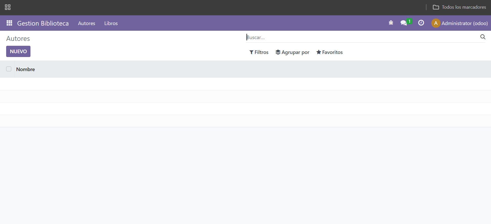

# [UT05](./index.md)

## PR0501: Creación de un módulo básico
```
PR0501: Creación de un módulo básico 

1.- En Docker Desktop en la terminal vamos a la carpeta volumesOdoo y ejecutamos docker exec -ti odoo_prod bash y luego odoo scaffold reservas_salas mnt/extra-addons para crear reservas_salas.

2.- En reservas_salas vamos a __manifest__.py y modificamos su código. En models -> models.py
modificamos su código y en views -> views.py modificamos su código.
```


## Codigo 501
```
__manifest__.py

# -*- coding: utf-8 -*-
{
    'name': "Gestión de reservas de salas",

    'summary': """
        Modulo para la gestión de reserva de salas""",

    'description': """
        Modulo que permite reservar salas con una prioridad asociada. Permite marcar tareas
        como realizadas o no realizadas y tiene un campo calculado llamado 'Urgente' que se 
        marca si la propiedad es superior a 10
    """,

    'author': "Leonb",
    'website': "https://www.yourcompany.com",

    'application': True,
    'category': 'Tools',
    'version': '0.1',
    'depends': ['base'],

    # always loaded
    'data': [
        'views/views.xml',
        'security/ir.model.access.csv',
    ],
}


models.py

# -*- coding: utf-8 -*-

from odoo import models, fields, api


class reservas_salas(models.Model):
    _name = 'reservas_salas.reservas_salas'
    _description = 'reservas_salas.reservas_salas'

    nombre = fields.Char()
    capacidad = fields.Integer()
    fecha_reserva = fields.Date()
    reservada = fields.Boolean()
    comentarios = fields.Char()


views.py

<odoo>
  <data>
    <!-- explicit list view definition -->

    <record model="ir.ui.view" id="reservas_salas.list">
      <field name="name">reservas_salas list</field>
      <field name="model">reservas_salas.reservas_salas</field>
      <field name="arch" type="xml">
        <tree>
          <field name="nombre"/>
          <field name="capacidad"/>
          <field name="fecha_reserva"/>
          <field name="reservada"/>
          <field name="comentarios"/>
        </tree>
      </field>
    </record>


    <!-- actions opening views on models -->
    
    <record id="reservas_salas.action_window" model="ir.actions.act_window">
      <field name="name">Salas</field>
      <field name="res_model">reservas_salas.reservas_salas</field>
      <field name="view_mode">tree,form</field>
    </record>


    <!-- server action to the one above -->
<!--
    <record model="ir.actions.server" id="reservas_salas.action_server">
      <field name="name">reservas_salas server</field>
      <field name="model_id" ref="model_reservas_salas_reservas_salas"/>
      <field name="state">code</field>
      <field name="code">
        action = {
          "type": "ir.actions.act_window",
          "view_mode": "tree,form",
          "res_model": model._name,
        }
      </field>
    </record>
-->

    <!-- Top menu item -->

    <menuitem name="Gestión de salas" id="reservas_salas.menu_root"/>

    <!-- menu categories -->

    <menuitem name="Salas" id="reservas_salas.menu_1" parent="reservas_salas.menu_root"/>
    <menuitem name="Reservas" id="reservas_salas.menu_2" parent="reservas_salas.menu_root"/>

    <!-- actions -->

    <menuitem name="Salas Disponibles" id="reservas_salas.menu_1_list" parent="reservas_salas.menu_1"
              action="reservas_salas.action_window"/>
    <menuitem name="Reservas realizadas" 
          id="reservas_salas.menu_reservas_realizadas" 
          parent="reservas_salas.menu_2" action="reservas_salas.action_window"/>


  </data>
</odoo>
```

## PR0502: Módulo con dos modelos
```
PR0502: Módulo con dos modelos

1.- En Docker Desktop en la terminal vamos a la carpeta volumesOdoo y ejecutamos docker exec -ti odoo_prod bash y luego odoo scaffold gestion_biblioteca mnt/extra-addons para crear gestion_biblioteca.

2.- En gestion_biblioteca vamos a __manifest__.py y modificamos su código, para ponerle el titulo y ponerle en data los xml que crearemos.

3.- En models -> __init__.py en vez de que importe models ponemos dos import de library_book y library_author.

4.- En models creamos library_author.py y library_book.py y los rellenamos como si fueran models pero personalizados para que cumplan con nuestros objetivos.

5.- En security ir.model.access.csv, añadimos dos lineas como esta access_library_book,access_library_book,model_library_book,base.group_user,1,1,1,1, para que nos coja nuestros modelos.

6.- En views creamos library_author_views.xml, library_book_views.xml y library_menu_views.xml, para crear la vista de gestion_biblioteca, con los id coincidiendo con los de models.
```



## Codigo 502
```
library_book.py
from odoo import models, fields

class LibraryBook(models.Model):
    _name = 'library.book'
    _description = 'Libro'

    name = fields.Char(string='Nombre', required=True)
    author = fields.Text(string='Autor')
    publish_date = fields.Date(string='Fecha de publicación')
    isbn = fields.Char(string='ISBN')
    synopsis = fields.Text(string='Sinopsis')


library_author.py

from odoo import models, fields

class LibraryAuthor(models.Model):
    _name = 'library.author'
    _description = 'Autor de Libros'

    name = fields.Char(string='Nombre', required=True)
    birthdate = fields.Date(string='Fecha de nacimiento')
    biography = fields.Text(string='Biografía')
    books = fields.Text(string='Libro')


models/__init__.py

from . import library_author
from . import library_book


__manifest__.py

{
    'name': 'Gestión Biblioteca',
    'version': '1.0',
    'depends': ['base'],
    'data': [
        'security/ir.model.access.csv',
        'views/library_menu_views.xml',
        'views/library_author_views.xml',
        'views/library_book_views.xml',
    ],
    'application': True,
}


library_author_views.xml
<odoo>
    <data>
        <record id="view_library_author_form" model="ir.ui.view">
            <field name="name">library.author.form</field>
            <field name="model">library.author</field>
            <field name="arch" type="xml">
                <form>
                    <sheet>
                        <group>
                            <field name="name"/>
                            <field name="birthdate"/>
                            <field name="biography"/>
                            <field name="books"/>
                        </group>
                    </sheet>
                </form>
            </field>
        </record>

        <record id="action_library_authors" model="ir.actions.act_window">
            <field name="name">Autores</field>
            <field name="res_model">library.author</field>
            <field name="view_mode">tree,form</field>
        </record>
    </data>
</odoo>


library_book_views.xml

<odoo>
    <data>
        <record id="view_library_book_form" model="ir.ui.view">
            <field name="name">library.book.form</field>
            <field name="model">library.book</field>
            <field name="arch" type="xml">
                <form>
                    <sheet>
                        <group>
                            <field name="name"/>
                            <field name="author"/>
                            <field name="publish_date"/>
                            <field name="isbn"/>
                            <field name="synopsis"/>
                        </group>
                    </sheet>
                </form>
            </field>
        </record>

        <record id="action_library_books" model="ir.actions.act_window">
            <field name="name">Libros</field>
            <field name="res_model">library.book</field>
            <field name="view_mode">tree,form</field>
        </record>
    </data>
</odoo>


library_menu_views.xml

<odoo>
    <menuitem id="library_menu_root" name="Gestion Biblioteca"/>

    <record id="action_library_authors" model="ir.actions.act_window">
      <field name="name">Autores</field>
      <field name="res_model">library.author</field>
      <field name="view_mode">tree,form</field>
    </record>

    <menuitem id="library_menu_authors" name="Autores"
              parent="library_menu_root" action="action_library_authors"/>

    <record id="action_library_books" model="ir.actions.act_window">
        <field name="name">Libros</field>
        <field name="res_model">library.book</field>
        <field name="view_mode">tree,form</field>
    </record>

    <menuitem id="library_menu_books" name="Libros"
              parent="library_menu_root" action="action_library_books"/>
</odoo>


ir.model.access.csv

id,name,model_id:id,group_id:id,perm_read,perm_write,perm_create,perm_unlink
access_library_author,access_library_author,model_library_author,base.group_user,1,1,1,1
access_library_book,access_library_book,model_library_book,base.group_user,1,1,1,1


```