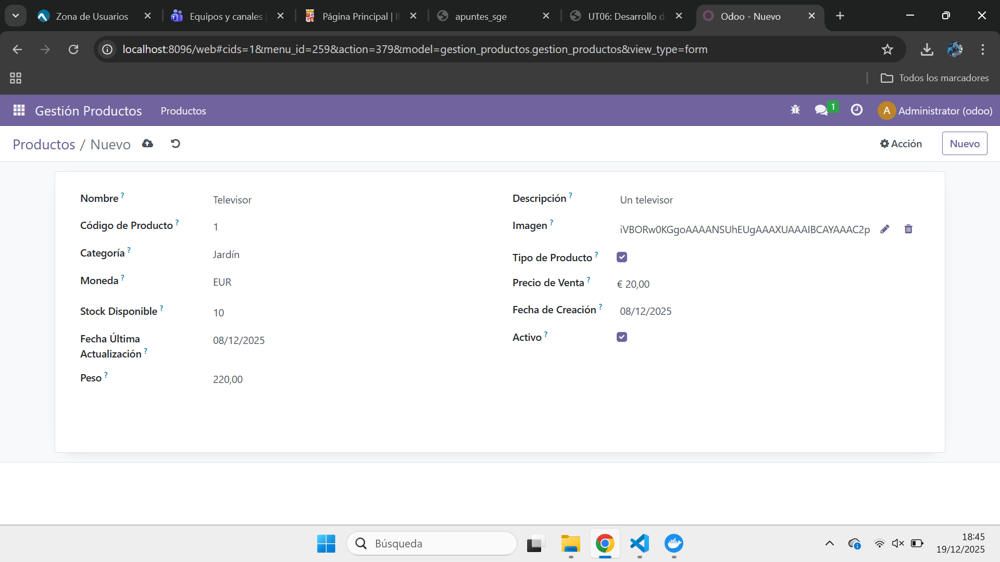

# [UT06](./index.md)

## PR0601: Campos del modelo
```
PR0601: Campos del modelo

1.- En Docker Desktop en la terminal vamos a la carpeta volumesOdoo y ejecutamos docker exec -ti odoo_prod bash y luego odoo scaffold gestion_productos mnt/extra-addons para crear gestion_productos.

2.- En gestion_productos vamos a __manifest__.py y modificamos su código. En models -> models.py
modificamos su código y en views -> views.py modificamos su código.
```


## Codigo 601
```
__manifest__.py

# -*- coding: utf-8 -*-
{
    'name': "Gestion Productos",

    'summary': """
        Modulo de Gestion de Productos""",

    'author': "Leonb",
    'website': "https://www.yourcompany.com",

    'category': 'Uncategorized',
    'version': '0.1',

    'depends': ['base'],

    'data': [
        'security/ir.model.access.csv',
        'views/views.xml',
        'views/templates.xml',
    ],
}


models.py

# -*- coding: utf-8 -*-

from odoo import models, fields


class GestionProductos(models.Model):
    _name = 'gestion_productos.gestion_productos'
    _description = 'Gestión de Productos'

    nombre = fields.Char(string="Nombre", required=True)
    descripcion = fields.Char(string="Descripción")

    codProducto = fields.Integer(
        string="Código de Producto",
        required=True
    )

    imaProducto = fields.Image(string="Imagen")

    categoria = fields.Selection([
        ('jardin', 'Jardín'),
        ('hogar', 'Hogar'),
        ('electrodomesticos', 'Electrodomésticos')
    ], string="Categoría")

    tipoProducto = fields.Boolean(string="Tipo de Producto")

    currency_id = fields.Many2one(
        'res.currency',
        string='Moneda',
        required=True,
        default=lambda self: self.env.company.currency_id
    )

    precVenta = fields.Monetary(
        string="Precio de Venta",
        currency_field='currency_id'
    )

    stockDisponible = fields.Integer(string="Stock Disponible")

    fechCreacion = fields.Date(string="Fecha de Creación")
    fechUltAct = fields.Date(string="Fecha Última Actualización")

    activo = fields.Boolean(
        string="Activo",
        default=True
    )

    peso = fields.Float(string="Peso")


views.py

<odoo>
  <data>

    <!-- LIST VIEW -->
    <record model="ir.ui.view" id="gestion_productos.list">
      <field name="name">gestion_productos list</field>
      <field name="model">gestion_productos.gestion_productos</field>
      <field name="arch" type="xml">
        <tree>
          <field name="nombre"/>
          <field name="descripcion"/>
          <field name="codProducto"/>
          <field name="categoria"/>
          <field name="precVenta"/>
          <field name="stockDisponible"/>
          <field name="activo"/>
        </tree>
      </field>
    </record>

    <!-- ACTION -->
    <record model="ir.actions.act_window" id="gestion_productos.action_window">
      <field name="name">Productos</field>
      <field name="res_model">gestion_productos.gestion_productos</field>
      <field name="view_mode">tree,form</field>
    </record>

    <!-- MENUS -->
    <menuitem name="Gestión Productos" id="gestion_productos.menu_root"/>
    <menuitem name="Productos"
              id="menu_productos"
              parent="gestion_productos.menu_root"
              action="gestion_productos.action_window"/>

  </data>
</odoo>


```

## PR0602: Campos del modelo
```
PR0602: Campos del modelo

1.- En Docker Desktop en la terminal vamos a la carpeta volumesOdoo y ejecutamos docker exec -ti odoo_prod bash y luego odoo scaffold library_lgn mnt/extra-addons para crear library_lgn.

2.- Creamos en views/ library_autor.xml, library_genero.xml, library_libro.xml, library_socio.xml y library_views.xml y en models/ library_author.py, library_book.py, library_genero.py y library_socio.py.

3.- En library_lgn vamos a __manifest__.py y modificamos su código. En models -> __init__.py
modificamos su código, en security -> ir.model.access.csv modificamos su código.

```

.png>)

## Codigo 602
```
manifest.py

# -*- coding: utf-8 -*-
{
    'name': "Library Lgn",

    'author': "leonb",
    'website': "https://www.yourcompany.com",
    'category': 'Uncategorized',
    'version': '0.1',
    'depends': ['base'],
    'data': [
        'security/ir.model.access.csv',
        'views/library_autor.xml',
        'views/library_libro.xml',
        'views/library_socio.xml',
        'views/library_genero.xml',
        'views/library_views.xml',
    ],
    # only loaded in demonstration mode
    'application': True,
}


library_autor.xml

<odoo>
    <data>
        <record id="view_library_lgn_autor_form" model="ir.ui.view">
            <field name="name">library_lgn.autor.form</field>
            <field name="model">library_lgn.autor</field>
            <field name="arch" type="xml">
                <form>
                    <sheet>
                        <group>
                            <field name="nombre"/>
                            <field name="paisorigen"/>
                        </group>

                        <notebook>
                            <page string="Libros como autor">
                                <field name="libro_autor_ids"/>
                            </page>

                            <page string="Libros como revisor">
                                <field name="libro_revisor_ids"/>
                            </page>
                        </notebook>
                    </sheet>
                </form>
            </field>
        </record>

        <record id="view_library_lgn_autor_tree" model="ir.ui.view">
            <field name="name">library_lgn.autor.tree</field>
            <field name="model">library_lgn.autor</field>
            <field name="arch" type="xml">
                <tree>
                    <field name="nombre"/>
                    <field name="paisorigen"/>
                </tree>
            </field>
        </record>

        <record id="action_library_lgn_authors" model="ir.actions.act_window">
            <field name="name">Autores</field>
            <field name="res_model">library_lgn.autor</field>
            <field name="view_mode">tree,form</field>
        </record>
    </data>
</odoo>


library_genero.xml

<odoo>
    <data>
        <record id="view_library_lgn_genero_form" model="ir.ui.view">
            <field name="name">library_lgn.genero.form</field>
            <field name="model">library_lgn.genero</field>
            <field name="arch" type="xml">
                <form>
                    <sheet>
                        <field name="name"/>
                    </sheet>
                </form>
            </field>
        </record>

        <record id="view_library_lgn_genero_tree" model="ir.ui.view">
            <field name="name">library_lgn.genero.tree</field>
            <field name="model">library_lgn.genero</field>
            <field name="arch" type="xml">
                <tree>
                    <field name="name"/>
                </tree>
            </field>
        </record>

        <record id="action_library_lgn_genero" model="ir.actions.act_window">
            <field name="name">Géneros</field>
            <field name="res_model">library_lgn.genero</field>
            <field name="view_mode">tree,form</field>
            <field name="view_id" ref="view_library_lgn_genero_tree"/>
        </record>
    </data>
</odoo>


library_libro.xml

<odoo>
    <data>
        <record id="view_library_lgn_libro_form" model="ir.ui.view">
            <field name="name">library_lgn.libro.form</field>
            <field name="model">library_lgn.libro</field>
            <field name="arch" type="xml">
                <form>
                    <sheet>
                        <group>
                            <field name="titulo"/>
                            <field name="genero_id"/>
                        </group>

                        <group string="Participantes">
                            <field name="autor_ids" widget="many2many_tags"/>
                            <field name="revisor_ids" widget="many2many_tags"/>
                        </group>

                        <group>
                            <field name="socios"/>
                        </group>
                    </sheet>
                </form>
            </field>
        </record>


        <record id="view_library_lgn_libro_tree" model="ir.ui.view">
            <field name="name">library_lgn.libro.tree</field>
            <field name="model">library_lgn.libro</field>
            <field name="arch" type="xml">
                <tree>
                    <field name="titulo"/>
                    <field name="autor_ids"/>
                    <field name="revisor_ids"/>
                    <field name="genero_id"/>
                </tree>
            </field>
        </record>


        <record id="action_library_lgn_libro" model="ir.actions.act_window">
            <field name="name">Libros</field>
            <field name="res_model">library_lgn.libro</field>
            <field name="view_mode">tree,form</field>
        </record>

    </data>
</odoo>


library_socio.xml

<odoo>
    <data>
        <record id="view_library_lgn_socio_form" model="ir.ui.view">
            <field name="name">library_lgn.socio.form</field>
            <field name="model">library_lgn.socio</field>
            <field name="arch" type="xml">
                <form>
                    <sheet>
                        <field name="nombre"/>
                        <field name="tele"/>
                        <field name="libros"/>
                    </sheet>
                </form>
            </field>
        </record>

        <record id="view_library_lgn_socio_tree" model="ir.ui.view">
            <field name="name">library_lgn.socio.tree</field>
            <field name="model">library_lgn.socio</field>
            <field name="arch" type="xml">
                <tree>
                    <field name="nombre"/>
                    <field name="tele"/>
                </tree>
            </field>
        </record>

        <record id="action_library_lgn_socio" model="ir.actions.act_window">
            <field name="name">Socios</field>
            <field name="res_model">library_lgn.socio</field>
            <field name="view_mode">tree,form</field>
            <field name="view_id" ref="view_library_lgn_socio_tree"/>
        </record>
    </data>
</odoo>


library_views.xml

<odoo>
    <data>
        <menuitem id="menu_library_lgn_root" name="Libreria LGN" sequence="10"/>

        <menuitem id="menu_library_lgn_authors"
                  name="Autores"
                  parent="menu_library_lgn_root"
                  action="action_library_lgn_authors"/>

        <menuitem id="menu_library_lgn_libros"
                  name="Libros"
                  parent="menu_library_lgn_root"
                  action="action_library_lgn_libro"/>

        <menuitem id="menu_library_lgn_socios"
                  name="Socios"
                  parent="menu_library_lgn_root"
                  action="action_library_lgn_socio"/>

        <menuitem id="menu_library_lgn_genero"
                  name="Generos"
                  parent="menu_library_lgn_root"
                  action="action_library_lgn_genero"/>
    </data>
</odoo>


ir.model.access.csv

id,name,model_id:id,group_id:id,perm_read,perm_write,perm_create,perm_unlink
access_library_libro,access_library_libro,model_library_lgn_libro,base.group_user,1,1,1,1
access_library_autor,access_library_autor,model_library_lgn_autor,base.group_user,1,1,1,1
access_library_socio,access_library_socio,model_library_lgn_socio,base.group_user,1,1,1,1
access_library_genero,access_library_genero,model_library_lgn_genero,base.group_user,1,1,1,1


library_author.py

from odoo import models, fields

class LibraryAuthor(models.Model):
    _name = 'library_lgn.autor'
    _description = 'Autor / Revisor'

    nombre = fields.Char(string='Nombre', required=True)
    paisorigen = fields.Many2one('res.country', string='País de origen')

    libro_autor_ids = fields.Many2many(
        'library_lgn.libro',
        'library_libro_autor_rel',
        'autor_id',
        'libro_id',
        string='Libros como autor'
    )

    libro_revisor_ids = fields.Many2many(
        'library_lgn.libro',
        'library_libro_revisor_rel',
        'autor_id',
        'libro_id',
        string='Libros como revisor'
    )


library_book.py

from odoo import models, fields

class LibraryBook(models.Model):
    _name = 'library_lgn.libro'
    _description = 'Libro'

    titulo = fields.Char(string='Nombre', required=True)

    autor_ids = fields.Many2many(
        'library_lgn.autor',
        'library_libro_autor_rel',
        'libro_id',
        'autor_id',
        string='Autores'
    )

    revisor_ids = fields.Many2many(
        'library_lgn.autor',
        'library_libro_revisor_rel',
        'libro_id',
        'autor_id',
        string='Revisores'
    )

    genero_id = fields.Many2one('library_lgn.genero', string='Género')

    socios = fields.Many2many(
        'library_lgn.socio',
        string='Prestado a'
    )


library_genero.py

from odoo import models, fields

class LibraryGenero(models.Model):
    _name = 'library_lgn.genero'
    _description = 'Genero'

    name = fields.Char(string='Género', required=True)
    libro_ids = fields.One2many('library_lgn.libro', 'genero_id', string='Libros')


library_socio.py

from odoo import models, fields

class LibrarySocio(models.Model):
    _name = 'library_lgn.socio'
    _description = 'Socio libreria'

    nombre = fields.Char(string='Nombre', required=True)
    tele = fields.Char(string='Teléfono')
    libros = fields.Many2many('library_lgn.libro', string='Libros prestados')

```


## PR0603: Campos calculados y restricciones
```
PR0602: Campos calculados y restricciones

1.- En Docker Desktop en la terminal vamos a la carpeta volumesOdoo y ejecutamos docker exec -ti odoo_prod bash y luego odoo scaffold stock_management mnt/extra-addons para crear stock_management.

2.- Creamos en views/ menu.xml y en models/ stock_product.py.

3.- En stock_management vamos a __manifest__.py y modificamos su código, en views vamos a views.xml y modificamos su código, en models -> __init__.py y modificamos su código, en security -> ir.model.access.csv modificamos su código.

```

.png>)

## Codigo 603
```
__manifest__.py

{
    'name': "Stock Management",
    'summary': "Gestión de inventario",
    'description': "Módulo para manejar productos y stock",
    'author': "leonb",
    'website': "https://www.yourcompany.com",
    'category': 'Inventory',
    'version': '0.1',
    'depends': ['base'],
    'data': [
        'security/ir.model.access.csv',
        'views/menu.xml',
        'views/views.xml',
    ],

    'application': True,
}


menu.xml

<odoo>
    <data>
        <record id="action_stock_product" model="ir.actions.act_window">
            <field name="name">Stock Management</field>
            <field name="res_model">stock.product</field>
            <field name="view_mode">tree,form</field>
        </record>

        <menuitem id="menu_stock_root" name="Stock Management"/>

        <menuitem id="menu_stock_management"
                  name="Stock Management"
                  parent="menu_stock_root"
                  action="action_stock_product"/>
    </data>
</odoo>


views.xml

<odoo>
    <data>
        <record id="view_stock_product_tree" model="ir.ui.view">
            <field name="name">stock.product.tree</field>
            <field name="model">stock.product</field>
            <field name="arch" type="xml">
                <tree string="Productos">
                    <field name="name"/>
                    <field name="category"/>
                    <field name="price"/>
                    <field name="quantity"/>
                    <field name="total_value"/>
                    <field name="stock_status"/>
                    <field name="full_name"/>
                </tree>
            </field>
        </record>

        <record id="view_stock_product_form" model="ir.ui.view">
            <field name="name">stock.product.form</field>
            <field name="model">stock.product</field>
            <field name="arch" type="xml">
                <form string="Producto">
                    <sheet>
                        <group>
                            <field name="name"/>
                            <field name="category"/>
                            <field name="price"/>
                            <field name="quantity"/>
                            <field name="total_value"/>
                            <field name="minimum_quantity"/>
                            <field name="stock_status"/>
                            <field name="full_name"/>
                        </group>
                    </sheet>
                </form>
            </field>
        </record>
    </data>
</odoo>


ir.model.access.csv

id,name,model_id:id,group_id:id,perm_read,perm_write,perm_create,perm_unlink
access_stock_product_user,stock.product user,model_stock_product,base.group_user,1,1,1,1


__init__.py

# -*- coding: utf-8 -*-

from . import stock_product


stock_product.py

# -*- coding: utf-8 -*-

from odoo.exceptions import ValidationError
from odoo import models, fields, api


class stock_product(models.Model):
    _name = 'stock.product'
    _description = 'stock.product'
    _sql_constraints=[
        ('unique_name','unique(name)','El nombre debe ser unico'),
        ('check_price','CHECK(price > 0)','El precio debe ser positivo')]

    name = fields.Char()
    category = fields.Selection([
        ('televisor','Televisor'),
        ('movil','Movil'),
        ('ordenador','Ordenador'),
        ('microprocesadores','Microprocesadores')
    ])
    price = fields.Integer()
    quantity = fields.Integer()
    total_value = fields.Char(compute="_total", string='Total')
    minimum_quantity = fields.Integer()
    stock_status = fields.Selection([
        ('normal','Normal'),
        ('low_stock','Low Stock')
    ], compute='_compute_stock_status', store=True)
    full_name = fields.Text(compute="_full_name", string='Nombre completo')


    @api.constrains('price')
    def _price(self):
        for record in self:
            if record.price < 0:
                raise ValidationError('El precio debe ser > 0')
    @api.constrains('quantity')
    def _quantity(self):
        for record in self:
            if record.quantity <= 0:
                raise ValidationError('El cantidad debe ser >= 0')
            if record.quantity > 100000:
                raise ValidationError('El cantidad debe ser < 100000')
    @api.depends('quantity', 'minimum_quantity')
    def _compute_stock_status(self):
        for record in self:
            if record.quantity < record.minimum_quantity:
                record.stock_status = 'low_stock'
            else:
                record.stock_status = 'normal'
    @api.constrains('category')
    def _category(self):
        for record in self:
            if not record.category:
                raise ValidationError('Debe seleccionar una categoría')


    @api.depends('price','quantity')
    def _total(self):
        for record in self:
            record.total_value = record.price * record.quantity
    @api.depends('name', 'category')
    def _full_name(self):
        for record in self:
            record.full_name = (record.name or "") + " (" + (record.category or "") + ")"
```